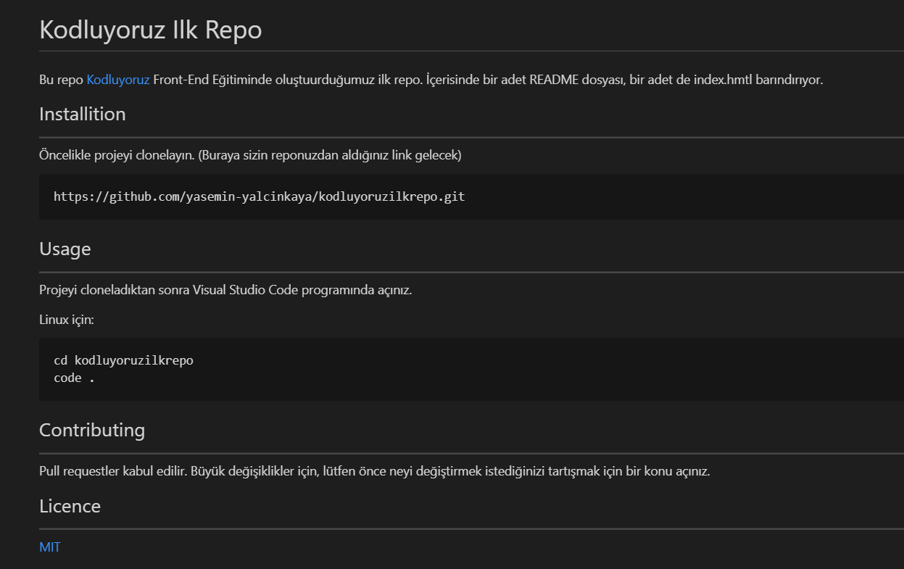

# Kodluyoruz Ilk Repo
Bu repo [Kodluyoruz](https://kodluyoruz.org) Front-End Eğitiminde oluştuurduğumuz ilk repo. İçerisinde bir adet README dosyası, bir adet de index.hmtl barındırıyor.



## Installition
---------------------
Öncelikle projeyi clonelayın. (Buraya sizin reponuzdan aldığınız link gelecek)

```
https://github.com/yasemin-yalcinkaya/kodluyoruzilkrepo.git
```


## Usage
---------------------
Projeyi cloneladıktan sonra Visual Studio Code programında açınız.

Linux için:
```
cd kodluyoruzilkrepo
code .
```


## Contributing
---------------------
Pull requestler kabul edilir. Büyük değişiklikler için, lütfen önce neyi değiştirmek istediğinizi tartışmak için bir konu açınız.


## Licence
---------------------
[MIT](https://choosealicense.com/licenses/mit/)
